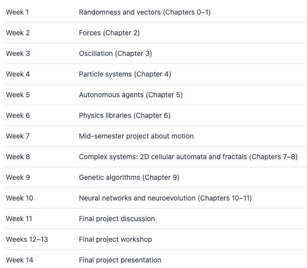

### Introduction

[nature of code](https://natureofcode.com/) | [github](https://github.com/nature-of-code/noc-book-2)

#### What Is This Book?

Nature of Code는 시뮬레이션과 알고리즘을 탐구하는 심화 과정입니다.
이 책의 목표는 물리 세계에서 자연적으로 발생하는 현상을 탐구하고 이를 소프트웨어로 시뮬레이션하는 방법을 코드로 구현하는 것에 대해 학습하는 것입니다.
책의 예제는 기본적인 시각화로 제공되지만 독자가 이를 확장해 창의적이고 흥미로운 작품을 제작하기를 격려하고 있습니다.
결론적으로, 이 책은 프로그래밍을 통해 자연 현상을 모델링하고 시뮬레이션하는 방법을 배우는 데 중점을 둡니다.

### The "Story" of This Book

이 책은 크게 3파트로 나눌 수 있습니다.

_Part1:Inanimate Objects(무생물)_

- 무생물이 물리적 환경에서 어떻게 움직일까? 그리고 이를 digital canvas에 어떻게 구현할 것인가?

1. randomness and vectors
   - 랜덤한 움직임과 xspeed, yspeed를 벡터로 모델링하는 법
   - vector를 이해하면 force를 표현할 수 있음
2. Forces
   - 뉴턴의 법칙 `F=ma`를 활용해 힘과 가속도가 물체의 움직임에 미치는 영향을 모델링
   - ex. 축구공을 찾을 때 축구공에 작용하는 중력과 바람 등
3. Oscillation
   - 물체의 angular acceleration과 진동을 시뮬레이션
   - 진자 운동, 스프링 같은 진동 운동 모델링
4. Particle systems
   - 다수의 입자(particle)를 생성하고 관리하는 방법
   - 객체 지향 프로그래밍의 상속과 다형성(polymorphism) 학습

_Part2:It's Alive!_

- 움직이는 생명체를 모델링하려면? 환경을 인지하고 반응하는 객체를 어떻게 구현할 수 있는가?

1. Autonomous agents(자율 에이전트)
   - 객체가 주변환경을 이해하고 움직임을 결정한는 방법
   - ex. 돌고래가 물 위로 뛰어오르는 행동
2. Physics libraries
   - Matter.js와 Toxiclibs.js같은 물리 엔진을 활용해 더 정교한 동작 구현
   - 라이브러리를 통해 복잡한 물리적 상호작용 간소화
3. Complex system:2D cellular automata and fractals
   - Complex System: 개별 요소는 단순하지만 전체 시스템은 예측 불가능한 복잡한 행동을 보임
   - Cellular automata: 격자 상에서 세포의 생존 규칙 시뮬레이션
   - Fractals: 자연의 기하학적 패턴 생성

_Part3:Intelligence_

- 객체에 지능과 학습 능력을 부여하려면 어떻게 해야 할까?

1. Genetic algorithms
   - 진화의 생물학적 과정을 기반으로 객체의 행동을 발전시키는 방법
   - ex. 최적화 문제 해결
2. Neural networks
   - 인공 신경망을 코딩하여 학습 및 의사결정을 구현
   - ex. 패턴 인식
3. Neuroevolution
   - 객체가 경험을 통해 학습하고 환경에 적용하는 알고리즘 개발
   - 진화적 학습과 신경망 결합

### Using This Book as a Syllabus

