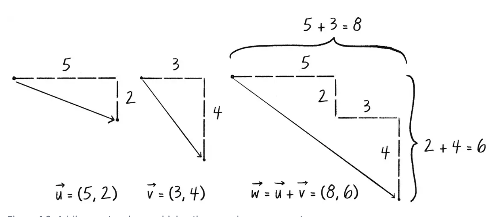
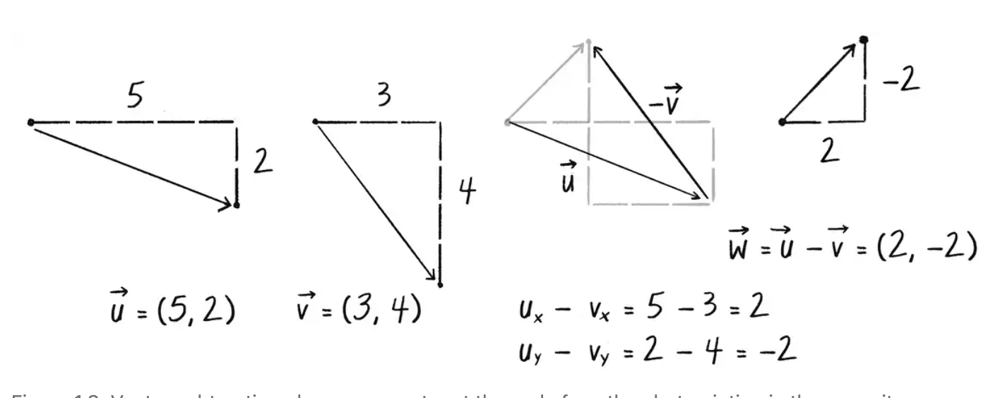
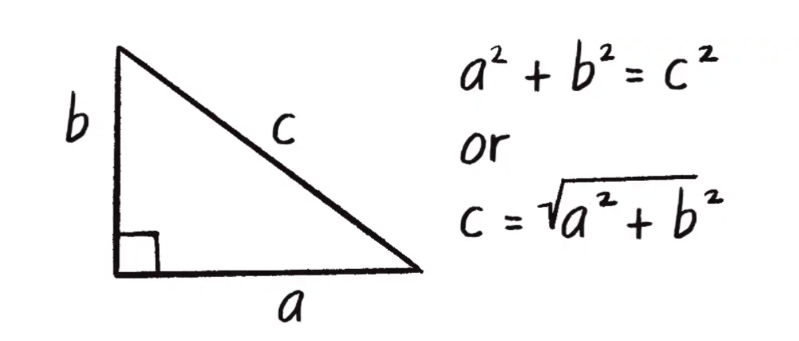
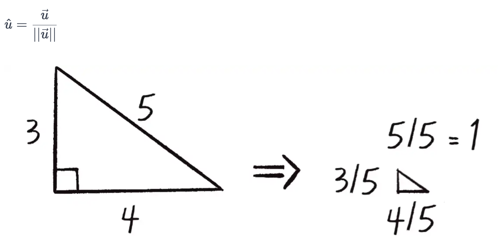

# Vectors

- 유클리드 벡터: 크기와 방향을 모두 가진 entity
  벡터는 화살표로 표현되며 화살표의 길이는 벡터의 크기를 나타내고, 화살표의 방향은 벡터의 방향을 나타냅니다.

## The Point of Vectors

- [공튀기기 예제]('../../../../src/01.Vectors/index.ts')

- 벡터는 두 지점 사이의 차이 또는 한 지점에서 다른 지점으로 걸어가는 지침으로도 생각할 수 있다. 예를 들어 아래와 같은 방식으로 생각할 수도 있다.
  | vector | Instructions |
  | ------ | ------ |
  | (-15, 3) | walk 15 steps west, turn and walk 3steps north |
  | (3, 4) | walk 3 steps east, turn and walk 4 steps north |
  | (2, -1) | walk 2 steps east, turn and walk 1 step south |

벡터는 객체의 속도를 설정하는데 이는 시간에 대한 객체 위치의 변화율로 정의된다. (v = dx/dt)
-> new position is equal to the result of applying the velocity to the current position

그렇다면 위치는 벡터라고 할 수 있을까? 기술적으로 위치는 움직임을 가지지 않으므로 벡터가 아니라고 주장할 수 있지만 만약 위치를 벡터가 이동한 경로라고 생각한다면 벡터로 생각할 수 있다.

## Vector Addition

## Vector Subtraction

## Vector Magnitude

벡터의 크기는 벡터의 성분이 음수일지라도 항상 양수이다.

## Normalizing Vectors

표준 벡터의 길이는 1이다. 벡터를 정규화한다는 것은 어떤 길의 벡터를 취해 방향을 바꾸지 않고 길이를 1로 바꾸는 것을 말한다. 이 때 정규화된 벡터는 단위 벡터라고 한다.
단위 벡터는 길이와 상관없이 벡터의 방향을 설명한다.

## Motion with Vectors

벡터를 이용한 모션은 아래와 같이 수행된다.

1. 위치에 속도를 더한다.
2. 해당 위치에 객체를 그린다.

## Acceleration

가속은 속도의 변화율이다.

알고리즘1: Constant Acceleration

알고리즘2: 무작위 가속

알고리즘3: 상호 작용 모션
